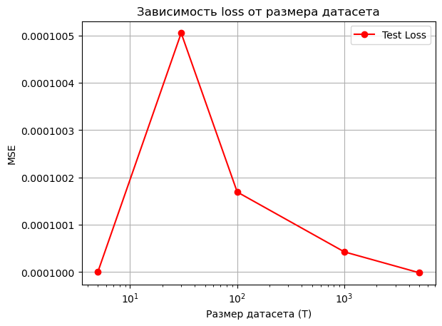
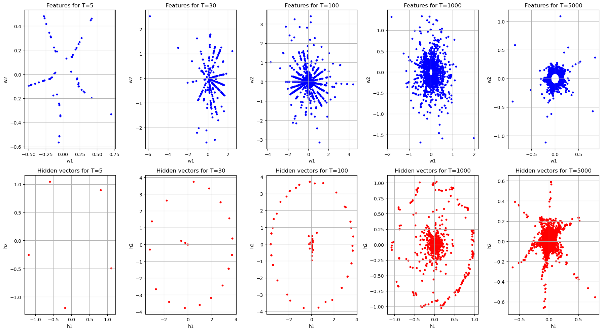

# double-descent

## Полученные результаты

**График loss**:
- T = 5: Низкие test loss из-за запоминания.
- T = 30, 100, 1000: Test loss достигает пика, так как модель переходит от запоминания к обобщению.
- \(T = 5000\): Test loss снижается, так как модель обобщает.

**Фичи и скрытый слой**:
- T = 5: Разреженные точки формируют четкий 5-угольник для признаков и скрытых векторов, полностью соответствуя ожиданию, поскольку происходит запоминание каждой из 5 точек из-за малого объема данных.
- T = 30, 100, 1000: Умеренная плотность точек для признаков и нечеткие кластеры для скрытых векторов, близкие к переходному режиму, что соответствует ожидаемой начальной кластеризации и переходу от запоминания к обобщению при увеличении данных.
- T = 5000: Признаки и скрытые векторы показали плотный круг и симметричный пентагона с 5 доминирующими направлениями, что связано с обобщением на больших данных.

## В процессе были следующие проблемы
1. **Числовая нестабильность**: Деление на ноль при вычислении (D_{X_i}) для этого добавил константу (1e-8).
